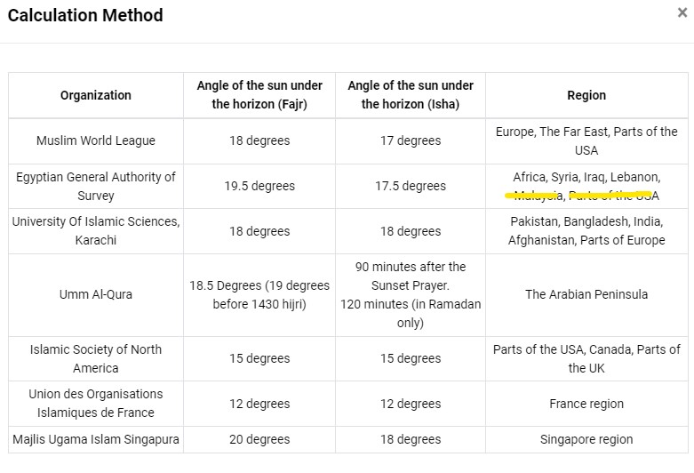
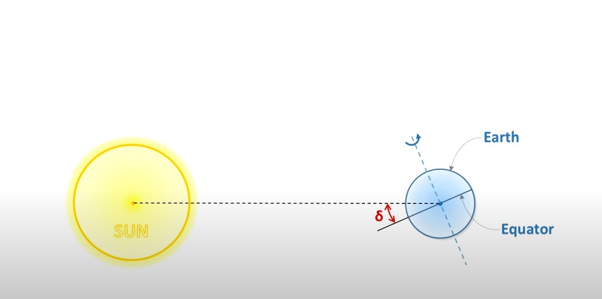
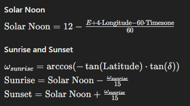
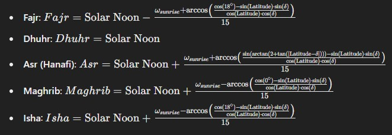

## Prayer Times

#### Pendahuluan
Dalam penentuan waktu sholat di Qur'an Belajar, sebaiknya dipakai rules yaitu:
1. Jika di satu region ada lembaga yang memiliki otoritas untuk mengeluarkan waktu sholat, dan jadwal sholat dapat diakses/didapat daftar/ada API-nya, maka jadwal dari lembaga tersebut yang akan dipakai. Daftarnya adalah sebagai berikut:
    - wilayah Indonesia: SIHAT KEMENAG
    - Malaysia: JAKIM
    - Brunei:
    - Singapore: Majelis Ugama Islam Singapura
    - Ummul Quro (khusunya mekkah dan madinah)
    - Greater London (ada publikasi dalam bentuk pdf)

2. Untuk wilayah yang tidak memiliki lembaga otoritas, maka penghitungan waktu sholat mengikuti formala kalkulasi dengan beberapa penyesuain diantarnya:
    - Di negara-negara seperti Inggris bagian utara , negara-negara Skandinavia, dan Kanada bagian Utara, atau beberapa negara bagian di Selatan Australia dan Argentina bagian selatan  perhitungan waktu sholat bisa berbeda-beda, namun umumnya mengikuti salah satu metode yang diakui secara internasional. Karena letak lintangnya yang lebih tinggi, negara-negara ini mungkin juga menerapkan penyesuaian khusus untuk periode siang hari atau kegelapan terus menerus, seperti selama musim panas dan musim dingin.

      Di negara-negara dengan garis lintang tinggi seperti Finlandia dan sebagian Inggris, terdapat pertimbangan khusus untuk perhitungan Subuh dan Isya selama periode siang atau malam terus menerus. Beberapa penyesuaian tersebut antara lain:

        - Metode Berbasis Sudut:
          Menggunakan sudut yang umum (misalnya 18 derajat untuk Fajar dan 17 derajat untuk Isya) tetapi dengan penyesuaian pada kondisi ekstrim.

        - Metode Tengah Malam:
          Membagi malam menjadi bagian yang sama dan menetapkan waktu Subuh dan Isya berdasarkan pembagian tersebut.

        - Metode Sepertujuh Malam:
          Membagi malam menjadi tujuh bagian dan menggunakan satu bagian untuk menentukan waktu Subuh dan Isya.

        - Metode Lintang Terdekat:
          Menggunakan waktu sholat dari lokasi terdekat pada garis lintang yang lebih rendah dimana terdapat kondisi senja yang normal.

    - Di negara-negar semenanjung Arab, penghitungan umumnya menggunakan metode Ummul Quro, tetapi lembaga fatwa setempat juga menyesuaikan sudut-sudut subuh dan Isya sesuai dengan negara tersebut. Misal: Qatar, Uni Emirat Arab, Oman, Yaman, Kuwait, dll

Di bawah ini adalah daftar kalkulasi waktu sholat dari sumber [islamicFInder](https://islamicfinder.org)

### Cara menentukan waktu sholat

Penentuan waktu sholat menggunakan metode dan rumus khusus untuk menghitung waktu shalat berdasarkan posisi matahari. Berikut rincian rinci bagaimana setiap waktu sholat dihitung:

    1. Subuh
        Waktu subuh dihitung ketika matahari berada x derajat di bawah ufuk pada pagi hari. x tergantung dengan besar derajat yang digunakan oleh lembaga penghitung

    2. Dhuhur
        Waktu dzuhur dihitung pada saat matahari berada pada titik puncaknya, ditambah waktu yang diperlukan matahari untuk bergerak seperdelapan diameter tampak (kurang lebih 5 menit) <= menurut WML

    3. Ashar
        Penghitungan waktu Ashar yaitu bayangan suatu benda sama dengan panjangnya ditambah panjang bayangannya pada siang hari.

    4. Maghrib
        Waktu Maghrib dihitung ketika matahari terbenam sepenuhnya di bawah ufuk.

    5. Isya
        Waktu Isya dihitung ketika matahari berada y derajat di bawah ufuk pada malam hari. y tergantung dari besar sudut menurut lembaga penghitung.

## Formula Penghitungan waktu sholat

Seacara umum, langkah-langkah untuk menghitung waktu sholat adalah sebagai berikut:

    1. Mengubah tanggal masehi menjadi Julian
    2. Menghitung solar declination dan equation of time dari tanggal julian tersebut
    3. Menghitung waktu sholat dengan parameter solar declination dan EOT pada nomor 2, (termasuk parameter sudut subuh dan isya => tergantung metode yang digunakan lembaga penghitung)

#### Penghitungan waktu Julian

Julian date (JD)= Julian Date Number (JDN) + Fractional hours

JDN = [365.25×( tahun +4716)] + [30.6001×(bulan+1)] + hari + B −1524.5

    B adalah faktor koreksi tahun kabisat ==> B = 2 − A + (A/4) ==> A = tahun / 100 => integer

Fractional hours = (jam-12)/24 + m/1440 + detik/86400

JD = JDN + Fractional hours

#### Penghitungan Sun declination

sumber [video youtube](https://www.youtube.com/watch?v=ZALVBxzmPIk)

pengamatan sun declination.

Untuk menghitung sun declination:
")

#### Penghitungan Equation of time (EOT)

EOT menghitung perbedaan antara waktu matahari (seperti yang ditunjukkan oleh jam matahari) dan waktu jam standar. Kesenjangan ini muncul karena perubahan stabilitas orbit bumi dan kemiringan sumbunya.

EOT dihitung dengan rumus:

EOT = 229.18 ( 0.000075 + 0.001868 cosB − 0.032077 sinB −0.014615 cos(2B) − 0.040849sin(2B))

dengan:
B = 360/365 * (n-81) => n adalah hari sejak awal tahun

#### Penghitungan waktu sholat

mencari solar noon

setelah mendapat solar noon, menghitung waktu sholat
